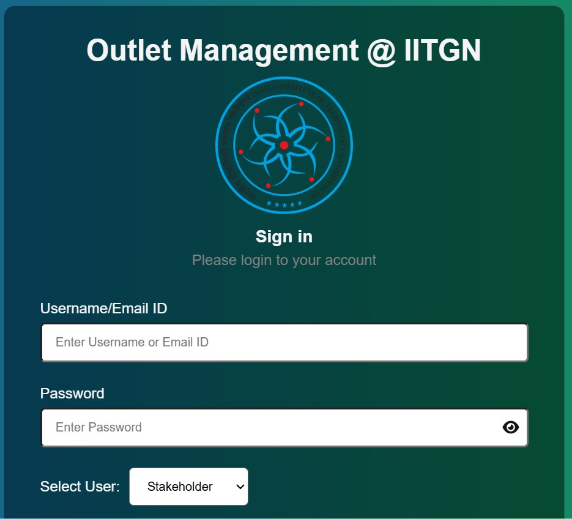

# IIT Gandhinagar Outlets Management System

> A web-based application for managing retail outlets, built with **HTML, CSS, Bootstrap, JavaScript, Flask, and MySQL**.
 

**1) Installation requirements:**\
pip install virtualenv\
pip install Flask\
pip install flask-mysqldb\
pip install mysqlclient

**2) Login Credentials:**\
In App.py Change your MYSQL Configurations

**3) Steps to Run the app**\
python -m venv venv\
/venv/Scripts/Activate\
python app.py

**4)Login Credentials:**\
Stakeholder:\
Email:shubham.kshirsagar@iitgn.ac.in\
Password:password

Student:\
Email:kajal.singh@iitgn.ac.in\
Password:password

